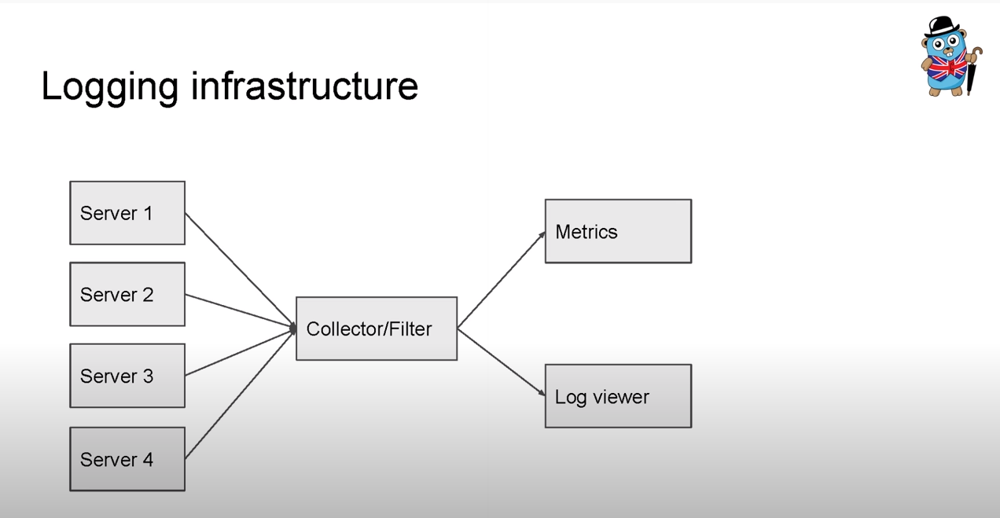

### What every developer should know about logging

[video link](https://www.youtube.com/watchv=F528FnxTo8E&t)

- Logging 101
	- Log is __simple text__ message printed by application
	- May have different levels
		- debug
		- info
		- error
	- Printing log message or writing log library is relatively easy
	- Maintaining logging infrastructure is complex task
  
- Why do we log?
	- [Debug] - Can help us to find some hard/strange application bugs
	- [Monitoring] - Performance measurement of certain action...

  

- An Approach
	- Logging to STDOUT
	- STDOUT redirected to file
	- Log forwarders are moving logs to centralized log server
	- log server allows tro browse/search/ analyze application behaviours

> Make sure your infrastructure wont cause problems to your application

- Logging infrastructure - applications
- Logstach- log filtering and forwaring
- Kibana - analysis and visualization
  

- Logs vs App Metrics vs Tracing
	- Logs are general debug information
	- Metrics measure application performance

> Sample log Message structure
> [timestamp][RID=foobar][RD=0.003][LD=0.001][serivice=API][search][result]

  
#### TODO
- [ ] How we use Kibana?
- [ ] How we trace /search and ask

##### Links
  [[Std log package in golang]]